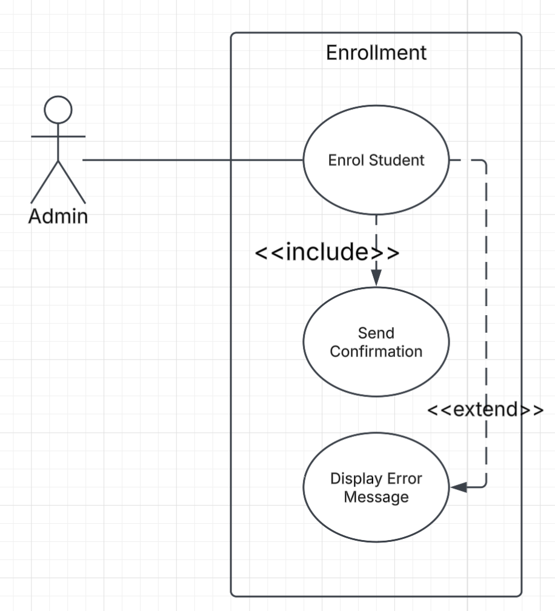
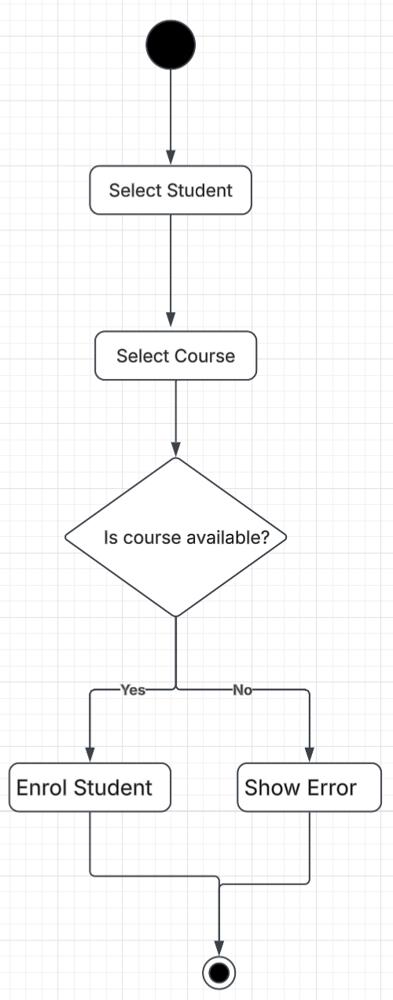
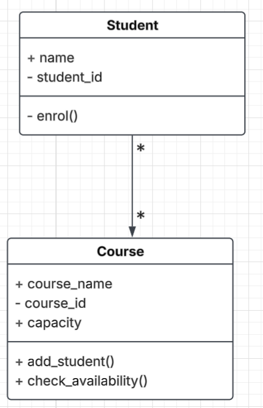

# UML Modeling Practice — Student Enrollment

This practice models the **Enrol Student** feature using three UML diagrams.

## Use Case Diagram

Shows how the Admin interacts with the enrollment system.

## Activity Diagram

Shows the enrollment workflow, including the decision based on course availability.

## Class Diagram

Shows the Student and Course classes, their attributes, methods, relationship, and multiplicity.

